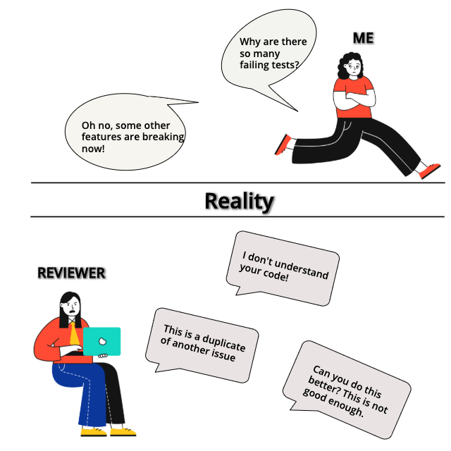
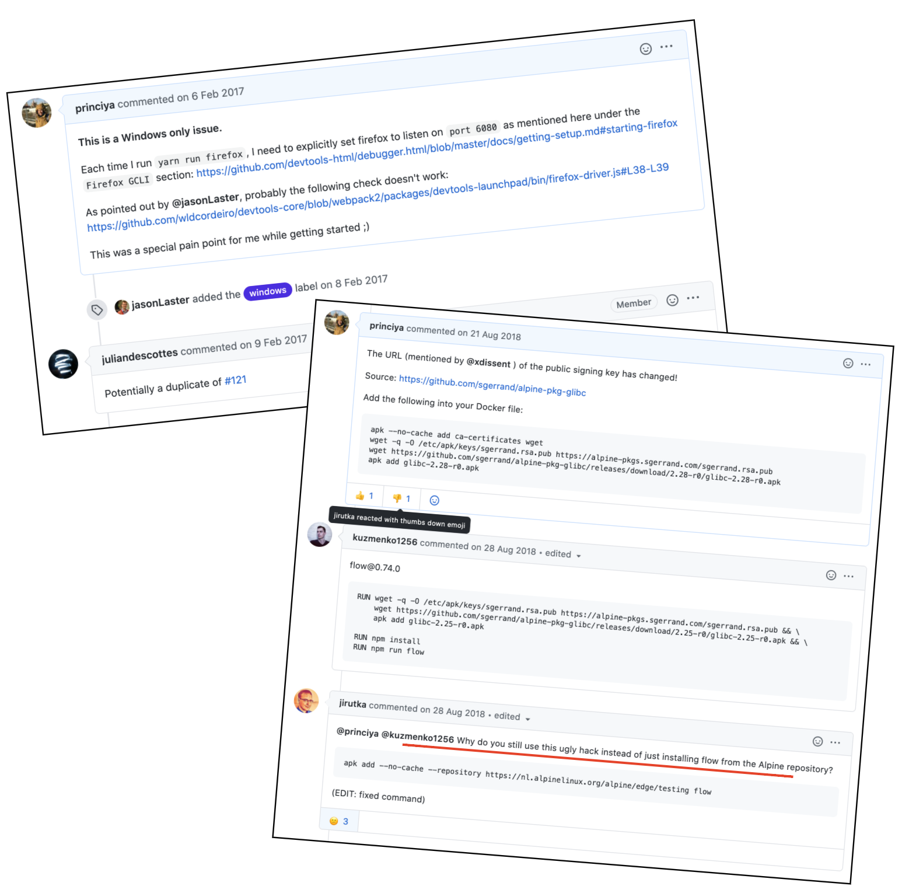
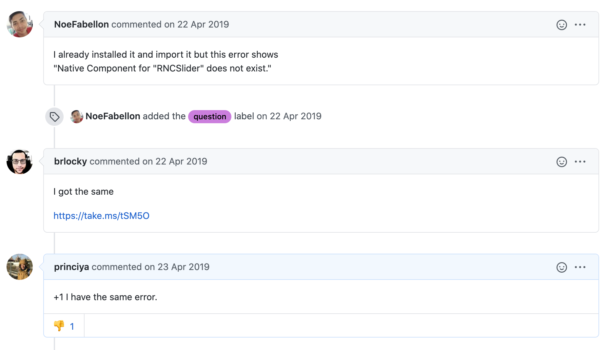

After learning `git` for the first time in 2015, I was expecting to contribute more to opensource.

But the reality turned out to be different.

In this post, I will talk about the expectation and reality of opensource contributions from the perspective of the contributor, maintainer, and 7 tips on how to get them right.

## The first-time opensource contributor experience

> My [first pull request](https://github.com/firefox-devtools/debugger/pulls?q=is%3Apr+author%3Aprinciya+is%3Aclosed) was to the Firefox devtools debugger project in February 2017.

First time pull request contributions can be very intimidating, and so was the case with me. Hoping to land my first-time contribution, I started observing 2016’s Hacktoberbest. But I was lost with the plenty of opensource projects to choose from. In 2015, I had a [first failed attempt](../ace-your-outreachy-application/#not-every-attempt-is-successful), but I was very determined in 2016. The entire October went with selecting projects until I settled down with the dev tools debugger project. It took another 3 months of observation into the project before I was confident of claiming the first issue. After the first pull request, I started to feel comfortable.

- The devtools debugger community did a great job of onboarding new contributors
- They had a good documentation
- The maintainers were available on slack for further questions and discussions
- Most important, they had a good code of conduct

### Tip #1

When you are building an opensource community, appreciate your first-time contributors, encourage them, and offer pair-programming support.

### Tip #2

Don’t treat any question as stupid. Remember, this can be the very first time that the contributor is even attempting to ask a question in a public forum.

> Since the maintainers were very supportive, I ended up having a great first-time contribution experience.

---

### Tip #3

Avoid nit-picking for first-time contributors.

Not everyone is a native English language speaker. Hence you can ignore the grammatical errors while naming variables or functions. Also, avoid using abbreviations as much as possible.

---

As for the horrible experience considered, my first nightmare was when someone commented on an issue I tried to help with a negative comment.

> Why do you still use this ugly hack instead of just installing xxxxxxxxxx?

What was bad about this comment, you may ask. Firstly, you cannot expect everyone to be at the same level as you in the opensource world. Obviously, I didn't know why the person referred it to be a hack and using `ugly` alongside made it even worse.

### Tip #4

Treat every contributor with respect.

### Tip #5

When you offer to give suggestions, write an explanation why you think they are relevant. From the above example, it would have been very helpful for me to know what was hacky about my solution.

---

Another example I can recall of a bad experience is when I added `+1` to an already reported issue. I was a bit disappointed as to why the maintainer had downvoted my comment. I brought this point with another maintainer, and he explained why this was not a good practice.

### Tip #6

It helps a maintainer when you explain in detail. In the example above, what would have helped the maintainer was me being able to replicate the issue, write detailed steps, and help them debug the issue rather than write `+1` as a comment.

---

The following incident happened to a repository I have been maintaining. There is no point venting your frustration in an issue comment unless you are offering to be helpful.

### Tip #7

Treat maintainers with respect too. In general, keep all the comments respectful!

Remember that most of the opensource contributions happen for free of cost. Be respectful of the contributors' and maintainers' blood, energy, and sweat.

---

Can you recall your first-time experience of creating a pull request or opening an issue to an opensource project? What is the one thing you can recall about what went well or a horrible experience you have had?

