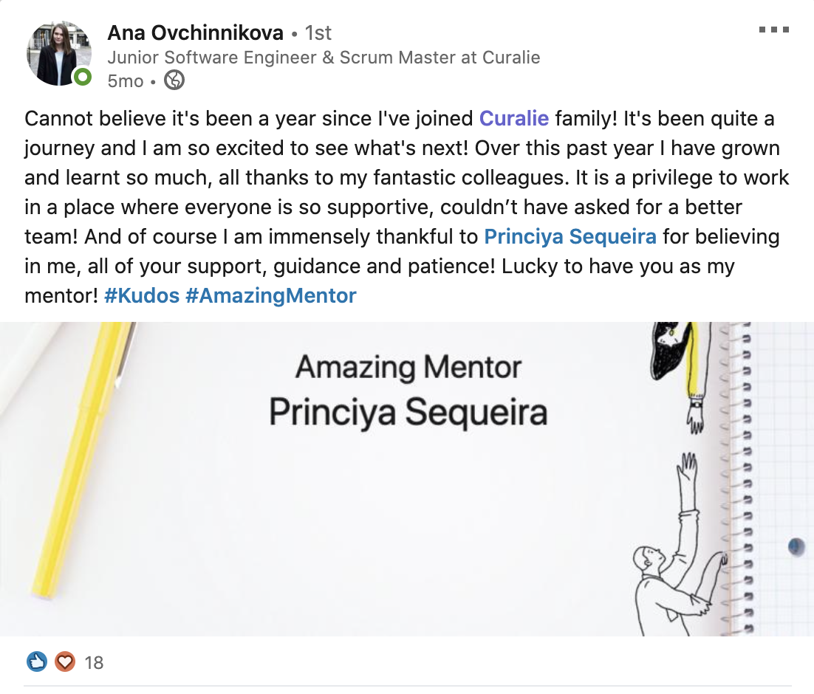

Are you the pivot person in your team, a.k.a the goto person for everyone's problems and solutions? Do you feel you don't get enough of your work done or over-working because you are constantly being called to resolve others issues? Does your unavailability mean your team is blocked?

If yes, then you are being the bottleneck in your team!

> You can reverse being a bottleneck in your team by learning the art of delegation.

In this post I will talk about how I had to unlearn from doing everything myself and learn to delegate. *This is part 1 of the series where I summarise how the transition was for me from an individual contributor to a lead role.*

Photo by <a href="https://unsplash.com/@hariprasad000?utm_source=unsplash&amp;utm_medium=referral&amp;utm_content=creditCopyText">Hari Nandakumar</a> on <a href="https://unsplash.com/t/nature?utm_source=unsplash&amp;utm_medium=referral&amp;utm_content=creditCopyText">Unsplash</a>

When I started at Curalie Gmbh in 2018, we were a 2 person Frontend team. After working a few months with freelancers and an external company, we hired a full-time third person into our team. This new hire had to report to me. I was really excited on being able to build a team and was looking forward to her first day. After she started I realised things at work were not the same anymore.

I knew I had to start all over again, this time I had to start with being a team lead. The first thing I had to learn was to **delegate tasks** to her. By the time I completed my first year at Curalie, we hired two more additional frontend developers. We were then a team of 5! At the time of writing this blog post (November 2020) we are 12 in our frontend engineering team.

## The art of delegation

As I mentioned before, when we hired the third person into our team, I had to learn to delegate tasks to her, and to do so, I had to **trust** in her to be able to do things.

> The art of delegation was to get comfortable with someone else doing it in a different way than me.

This didn't come to me naturally, and I was surprised how I was over-protective of the codebase and kept wondering how someone under my supervision would destroy it or not being able to write things correctly. This certainly improved over time and I was getting better at delegating work by breaking down Jira tickets into smaller sub-tasks.

Photo by <a href="https://unsplash.com/@rayhennessy?utm_source=unsplash&amp;utm_medium=referral&amp;utm_content=creditCopyText">Ray Hennessy</a> on <a href="https://unsplash.com/t/nature?utm_source=unsplash&amp;utm_medium=referral&amp;utm_content=creditCopyText">Unsplash</a>

## Key takeaways from delegation

- When working in a fast-paced startup, the team-lead is responsible to be a people manager alongside managing team's technical duties, like write code, fix bugs, handle incoming customer support queries, etc. The key takeaway was **I could not do everything**, although I loved doing everything or believed that I could do everything. I had to find the balance between **managing priorities** vs doing things I loved. I had to love the things I did, instead. For example, learning to manage priorities: Given a 3-week sprint, moving people 1:1's during the first week gave focus time during the 2nd, 3rd week on sprint goals and releases. Also, the 3rd week I had to keep buffer time to align with the QA, fix bugs and ensure a smooth release.
- When delegating something to someone, **maintaining a log**. This helped in being able to follow up or fill up their place when the delegate was on holiday or sick. For example: I always made a point to follow up on every pull request merged so that I could keep track of the changes made or atleast remember why, how, when something was changed. PS: I do have a good memory ;).
- **Documenting processes**, a.k.a knowledge sharing sessions within the team. This helped in onboarding new people and enabled everyone in the team to be aligned with each others work. For example: Setting up an excel sheet to keep track of incoming job applicants and having email templates enabled me to delegate this task before my vacation.
- Ensuring **atleast 3 people were able to work on one particular thing**, including myself. Although the log helped in filling up my directs place, when it came to managing priorities it helped being able to delegate to the third person as a backup plan.

Photo by <a href="https://unsplash.com/@iorni?utm_source=unsplash&amp;utm_medium=referral&amp;utm_content=creditCopyText">iorni.com</a> on <a href="https://unsplash.com/s/photos/birds?utm_source=unsplash&amp;utm_medium=referral&amp;utm_content=creditCopyText">Unsplash</a>

## What's next after delegation?

After learning to delegate and getting better at it, the next challenging thing was finding the time to work on my tasks. Delegation meant that others were doing things, but this also meant they had frequent queries and I had to be there to unblock them. In the next post I will talk more about how I managed my time efficiently to unblock others and focus on my tasks to be productive, a.k.a 'managing priorities'.

> Managing priorities === Deciding what not to do now!

---

PS: Earlier, I mentioned how excited I was when I learned that I would get to lead a team.

**2019**

https://twitter.com/princi_ya/status/1124252961247518720

**2020**

[Testimony]((https://www.linkedin.com/feed/update/urn:li:activity:6676024962941255680/)) of my first direct report when she completed a year.

