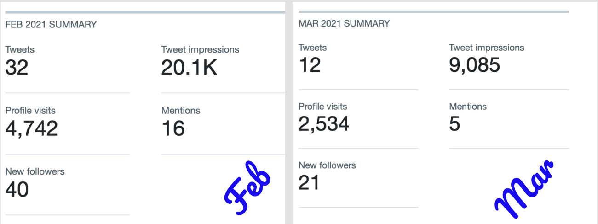
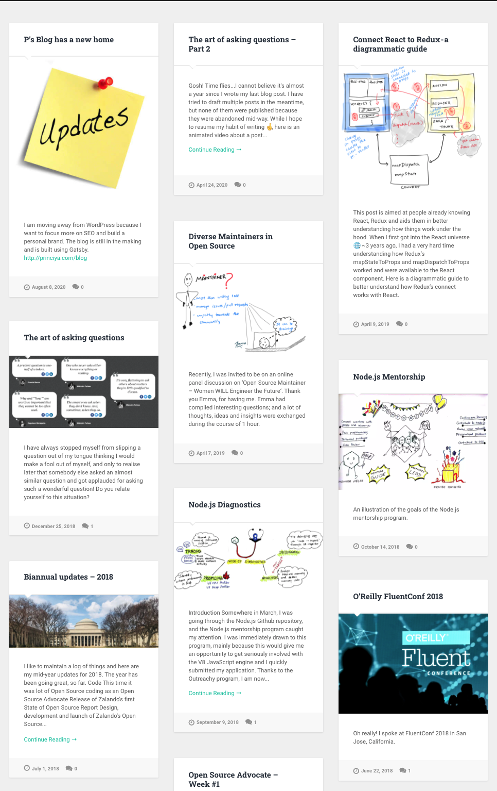
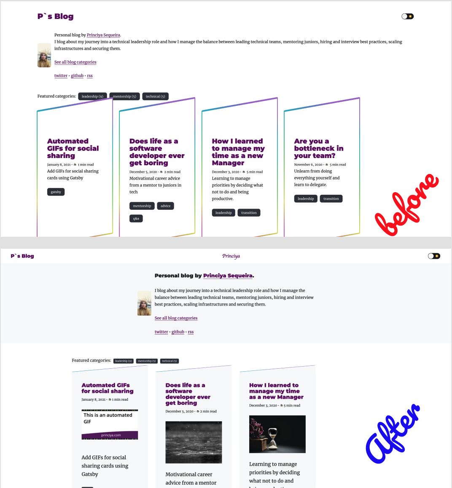

## Background

I signed up for the Blogging for Devs Spring Accelerator program with the intention to gain more Twitter followers, or atleast that was my pitch when I applied to the program. I was not too sure, but in general I wanted to increase my Twitter engagement and visibility. I signed up in early February 2021, the accelerator was due to begin from March 2021. In order to get a feel of how Twitter would treat me, I started tweeting more often.

### Expectations

I was hoping my tweets to get more attention and to be liked my many 😬, after all a little more publicity wouldn't have harmed me, but thanks to the Twitter's engagement algorithm, virality works in a different way.

### Reality

I got 61 new followers. I tweeted on wide variety of subjects, and below are my observations:

### What didn't work 🙅‍♀️

- Random programming memes. [Tweet](https://twitter.com/princi_ya/status/1364887924030857219)
- General advice without a personal context. [Tweet](https://twitter.com/princi_ya/status/1365267325650280459)

### What worked 👍

- Meme with a programming example. [Tweet](https://twitter.com/princi_ya/status/1364488330742620160)
- General advice with a personal context. [Tweet](https://twitter.com/princi_ya/status/1365584288838639616)
- Participating in discussions. [Tweet](https://twitter.com/princi_ya/status/1367381320666472451)
- Detailed [blog post](../ace-your-outreachy-application) on submitting Outreachy application. [Tweet](https://twitter.com/princi_ya/status/1358824692992249856)

I must admit that I was disappointed when tweets like asking for pet animal pictures worked, but mine didn't. I managed to get over the Twitter fatigue phase and this was a good exercise for me.

## Not ready to quit yet

Although Twitter didn't work this time, it does not mean it will not work again in the near future. But until then, I had to find my motivation and use the Spring Accelerator as a platform to get back to blogging consistently. I recalled the days when I used to [blog](https://princiya777.wordpress.com/) for fun.

Some of those [articles](https://princiya.com/pages/articles.html) got lot of traction too. I had blogged consistently during my [Outreachy](https://princiya777.wordpress.com/category/outreachy/) days and didn't worry about views and likes. I had also used the last six months in 2020 to blog consistently.

https://twitter.com/princi_ya/status/1340746583588089859

But somewhere in between, I got into the competitive band and lost my focus when success didn't come to me as I had expected. I am generally optimistic with my life and its choices, but I do have my fair share of blues. And this Twitter drama was one of it. Success does not happen overnight, I am very well aware of this. So I decided to blog again, consistently and most important to have fun. I write, because I like to and it was necessary for me to step back and realise what I was missing the last couple of months.

## Next steps

As an immediate first step, I redesigned my blog and improved the landing page.

For next steps, I want to continue writing however small it might be. My strectch goal is to write like [Seth Godin](https://seths.blog/) 🤞, I really enjoy his style.

Let's see how this goes. Happy blogging to myself 🎉.

