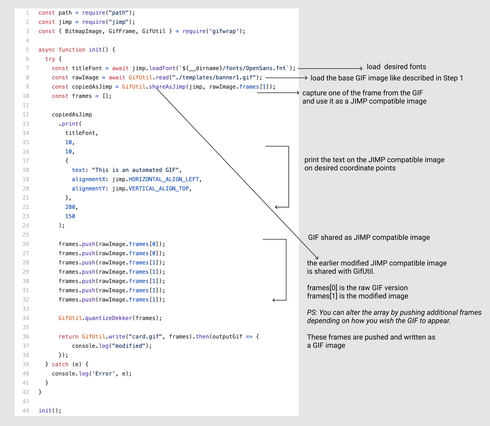

*Post updated: 22.03.2021*

I wanted to have automated social sharing cards for my Gatsby blog and I developed this as a side-project during the December 2020 holidays. While working on this, I wondered why not make the cards GIFfy. I was quite excited and was able to achieve what I wanted, only to get disappointed when I shared on Twitter that the GIF did not render as expected; it rendered as a non-GIF version. Given that I could not recall seeing a single GIF as a social card on Twitter, I should have known what to expect 😅.

https://twitter.com/princi_ya/status/1347585529408225280

Since then, this post has been long overdue. Recently, when I shared my blog post link with someone over Discord, the GIF worked. It worked on LinkedIn, it worked on Slack too. This motivated me to get back to this post to finish it off.

## Useful links

- [Source code](https://github.com/princiya/blog/tree/master/plugins/social-cards)
- [Tutorial reference](https://codeburst.io/how-to-automate-social-sharing-cards-on-your-gatsby-blog-77a356a58b38)

## Building a Gatsby plugin

> This was the first time I tried to build a Gatsby plugin.

### 1. Setup

I followed the above mentioned tutorial to setup a Gatsby plugin which would generate automated images; the tutorial was pretty straight forward. I used [Vectr](http://vectr.com/) to setup the below shown template which is the base GIF the plugin uses to print text.

It was the Christmas holiday season when I was working on this, and I picked the lights from this [Codepen](https://codepen.io/tobyj/pen/QjvEex).

I used [getwaves.io](https://getwaves.io/) to generate the wave for the base GIF template.

### 2. Using Node.js library

Once the base GIF template was ready, I needed a Node.js library which would generate a GIF programmatically. The tutorial post referred `Jimp` but the GIF encoder was [unavailable](https://github.com/oliver-moran/jimp/tree/master/packages/type-gif). I found `gifwrap`, a `Jimp` compatible [library](https://github.com/jtlapp/gifwrap) to work with GIFs.

The source [code](https://github.com/princiya/blog/blob/master/plugins/social-cards/gif.js) for generating a GIF file via Node.js explained 👇.

### 3. Add plugin to the Gatsby config

- I added the plugin to the [gatsby-config.js](https://github.com/princiya/blog/blob/master/gatsby-config.js#L32) file.
- Run `gatsby build` and the plugin will [create](https://github.com/princiya/blog/blob/master/plugins/social-cards/index.js#L89) a `card.gif` for every post. [Like this](https://github.com/princiya/blog/blob/gh-pages/are-you-a-new-tech-lead/card.gif)

