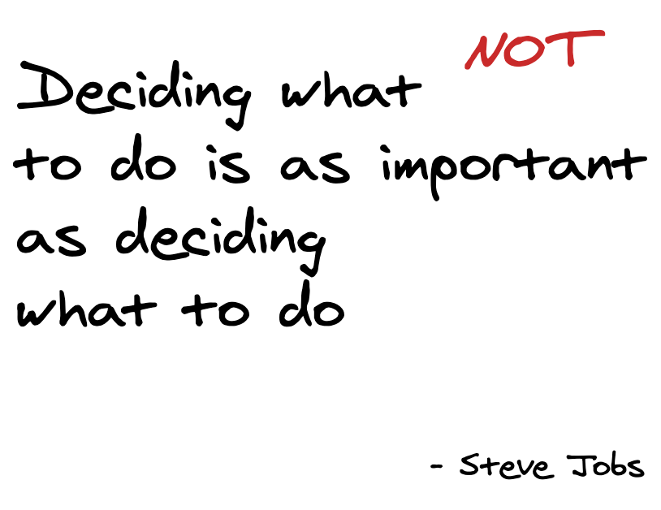
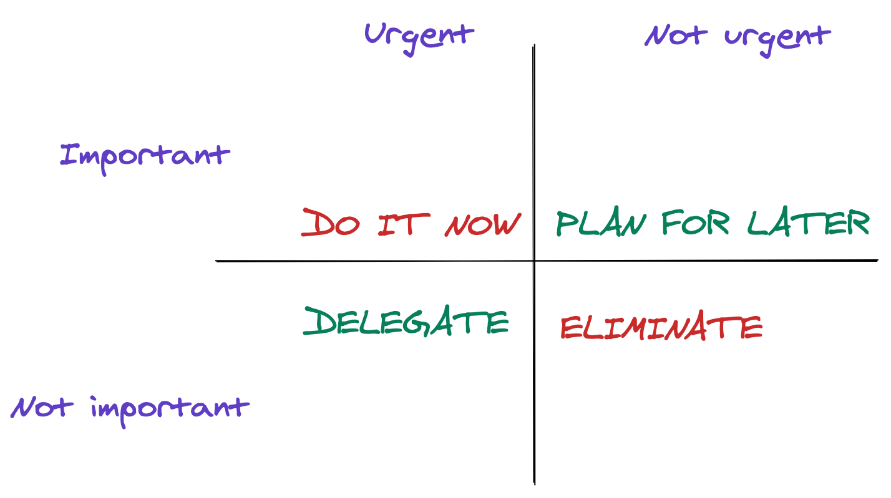

This is part 2 of the [series](../tags/transition), where I summarise how the transition was for me from an individual contributor to a lead role. In the previous [post](../do-not-be-a-bottleneck), I wrote about how I got better at delegating tasks.

*After learning to delegate and getting better at it, the next challenging thing was finding the time to work on my tasks. While delegation meant others were doing things, it also meant they had frequent queries. I was being interrupted often to unblock them while working on my tasks being delegated to me by my seniors. In this post, I will share time management tips for new managers and talk about how I managed my time efficiently to focus on my tasks to be productive.*

> Managing priorities === Deciding what not to do

## `Not` doing additional hours

As a Lead Engineer at [Curalie](../tags/leadership), my responsibilities are to ensure that we stick to our sprint commitments across multiple feature teams and ensure a smooth, continuous product delivery. In a 3-week sprint, the last week is mostly busy for me, with bug fixes happening and supporting the QA team. If someone from the Frontend team is sick or on vacation, I need to jump in to fill their void. This is part-1 of my responsibility. Part-2 of my responsibility includes the following:

- reading and replying to emails
- cross-team discussions
- scheduling hiring interviews
- reviewing others pull requests
- pair programming to unblock others
- documenting things
- 1:1 with direct reports

I had accustomed to the norm that writing code or closing tickets myself was core work. All the work which dealt with managing as secondary work. As a result, during the initial months, I used to spend a lot of hours on the weekend. Saturday mornings or Sunday evenings meant writing code I could not complete during the week due to the management tasks.

I had to learn not to do additional hours, especially on weekends, but instead realize that I was doing my job, although not coding all the time.

## Everything is `not` important

While accepting the fact that the management work was now part of my core work, I had to maintain a healthy balance between my tasks. The second thing I learned was that not everything is important.

> What is important doesn't have to include doing everything at once!

I like to have a clean email inbox and often have the tendency to reply to an email or respond to a slack message instantly. Given that I have decided to stick to my commitments to not over-work, when the sprint is in a crucial phase I decide to let the hiring application emails wait for sometime while concentrating on the sprint tasks.

### How to identify what is `not` important

At the time of writing this article, we were in the 3rd sprint week. The [bi-weekly accountability blog group](https://bloggingfordevs.com/pro/) was expecting us to have our submissions ready on 29th November 2020, the day I started jotting down my ideas for this post. I had to decide on the priorities —> sprint release or publish a blog post. The sprint was busy, mainly due to colleagues’ sickness and vacations. We completed the sprint, but I did not publish the blog on time. Did I lose anything? No! Did I gain something? Yes, my colleagues and our stakeholders were very happy for a timely release despite being understaffed.

Another example is leaving `n` number of browser tabs open to read everything. I personally do not like the chaos here and try to optimize as much as possible. If something can be read immediately, then I read it right away. If I am sure not to read it today, tomorrow, or even the next couple of days, then I bookmark it. I still struggle to manage my bookmarks, but it's a topic for another blog post 😬.

How is this example relevant to managing priorities or deciding what not to do? It is these small habits that help us better align our brain to do what we want to do. Building up to the above two rules that I mentioned -

- how much can I read in one day
- what is really important to read for today

## Elimination of non-priorities

> Nobody is busy; it is only a matter of prioritising what is important!

Having said all of the above, I do have a lot to do, but I never consider myself busy. I do feel overwhelmed at times, but I have got better with time in learning to identify the less important things.

Often during sprint planning, everything seems to be important. To stay focused on our sprint goals I constantly ask our product owners "why do we need this feature or a bug fix". WHY is a simple word, yet a powerful decisive factor when answered right. At one point, when the team was going through a stressful time period we even decided to reduce the sprint scope. The health and well-being of our colleagues were above the sprint goal.

Another example I can recall from a friend when she was a first-time mother is that when her baby slept during the day all she could think of was if to eat, take a shower or use the toilet peacefully without getting interrupted. These words have stuck to me eversince and always force me to think about my priorities for the moment. The house could remain uncleaned and so the dishes; it's only by saying NO that she could concentrate on the things that really mattered.

## Conclusion

Timing is everything! Once I learned to identify the important things, it got better over time to decide what not to do. In the next post in this [series](../tags/transition), I will talk about one of the time management strategies called the [Eisenhower Method](https://en.wikipedia.org/wiki/Time_management). 

*We encounter ideas all the time and often want to do everything at once. But time is limited. We only have 24 hours in a day. At work, I often encounter this situation. Before learning the art of delegation, I did take it on me to do everything. I was naturally interested in doing many things or dive into different topics, for example, automating tests, fixing security bugs, web performance, GraphQL, Amplify, DynamoDB, the list goes on. I will explain more in detail on how to effectively use the Eisenhower method to be efficient and productive.*

Meanwhile, let me know the things you have learned not to do to increase your productivity!

