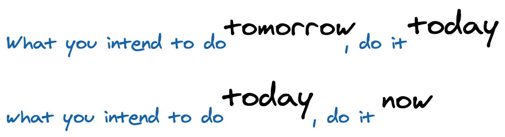

### `Not` procrastinating the important

> कल करे सो आज कर, आज करे सो अब कर 

This is a popular Hindi verse written by [Kabir Das](https://en.wikipedia.org/wiki/Kabir). It means the following -

If an email can be answered right away, then I prefer to reply instantly. If a slack message can be attended instantly, I do it so. It helps me take off the mental load about too many pending tasks for the day. Offcourse like I wrote earlier, priorities are important and have decided not to reply to interview applicants right away when the sprint was in a crucial phase. This instance was not about procrastination but rather realising what not to do for that time period.

### being productive by being lazy

Sometimes I have productive weekends, sometimes lazy. Why are the lazy weekends not considered productive? It is just a thing to convince my brain. What matters in the end is really if I was happy or not. If my body wants to sleep the whole day, then why not? Why is it called lazy? If I like a particular Netflix episode and want to binge watch it, then why not? The only priority to keep in mind is not to stress the eyes or mind.

I also apply the same principle at work. Not every day is a sunny day. Sometimes I don't feel like working, but as long as I admit it and use to do something else, I am fine with it. Not acknowledging this fact and rather sitting  and staring at the monitor for mircales to happen and solve a problem will not serve the purpose. If you are my employer or colleague reading this, please don't take me wrong. I do accept that I have this feeling, but I instead use to watch or read something interesting or even crack upon a blog idea.

It's a matter of time, and within an hour I would be refreshed enough to get back to work.

This year has been fairly well for me 💪 ✌️. I have been promoted at [Curalie](../tags/leadership) as Head of Frontend Engineering and plus I now successfully balance my time with two jobs. My secondary (part-time) job is being a Developer coach with [Raise](https://raise.dev/).

People who know me personally do know that I am known to be doing multiple things at the same time. Over time I have come to realise that this is a skill which only few possess. Recently I was suprised when I [discovered](../i-was-interim-cto) that I could code while also listening and replying in between meetings.

*In this post, I will mainly focus on my primary job!*

write before you're an expert on a subject; write to become an expert on a subject; share the best of what you’re learning.

character, connection, and competence.

## using privilege!

- accept mistakes in public - accountability
- appreciate others - pull others up
- improve offboarding, not just onboarding

## when only one female

- don't say "ladies first"

## building communities within tech team

- biweekly knowledge sharing
- study accountability groups
- friday project hack usergroups

## website illustrations

- resources for beautifying websites

## women bloggers

- showcase upcoming women bloggers

## time management

- distribution of responsibilities and time like this graph https://shekhargulati.com/2021/01/03/being-chief-technology-officer-lessons-learned-in-my-first-year/