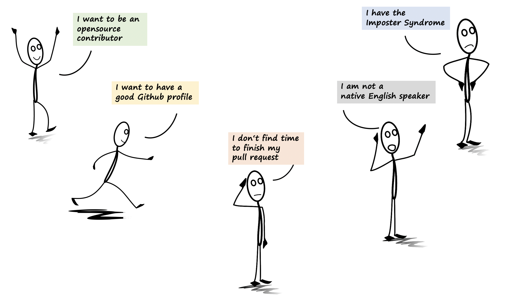
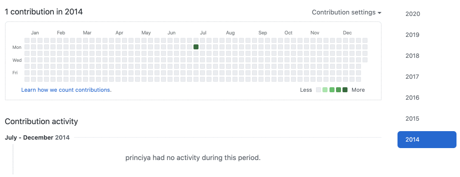
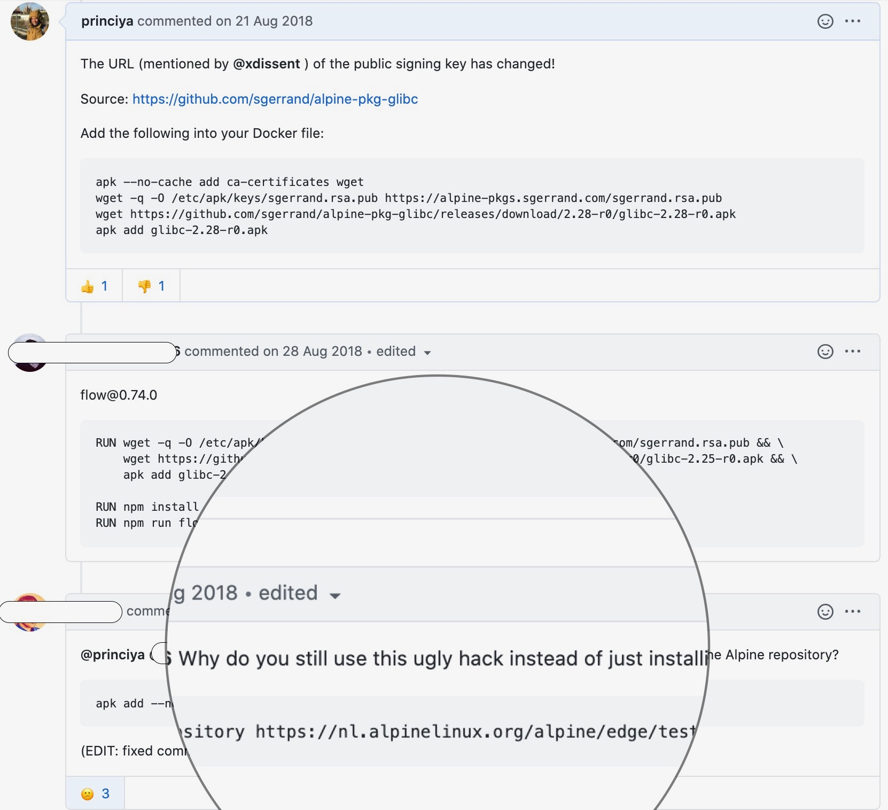
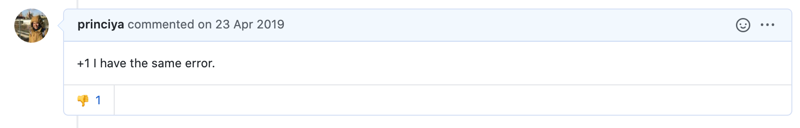

Are you a first-time opensource contributor or a seasoned one and find opensource `overwhelming`? Does it happen that everyone praises opensource or talks only good things, and you are struggling to `find the time` or motivation to contribute? Bonus, are you from an under-represented group in tech and have `imposter syndrome`?

I have gone through this phase, and this wasn't exactly what I expected. In this post, I will talk about the expectation and reality of opensource contributions from my perspective of being both a contributor and a maintainer.

## Background

I got into opensource through an [Outreachy](../ace-your-outreachy-application) internship in 2017. After the paid internship, I continued contributing to [Lightbeam](https://princiya.com/) (browser extension to visualise first and third-party web trackers) and subsequently stepped up to maintain the project. I have also contributed to the Firefox devtools debugger project and served as a community maintainer.

## Time is a crucial factor

Hoping to land my first-time contribution, I started observing 2016’s [Hacktoberfest](https://hacktoberfest.digitalocean.com/). But I was lost with plenty of opensource projects to choose from. The entire October went with selecting projects until I settled down with the Firefox devtools debugger project. It took another 3 months of observation into the project before I was confident of claiming the first issue.

Although I was comfortable after my first pull request, finding the time to work on more contributions was constantly challenging. Not to forget, it took me `3 months` until I had my first pull request merged!

## Finding the motivation

Motivation is directly proportional to finding the time! Motivation is found when the `purpose is discovered`. As I recall today, it does seem funny, but I wanted to get into opensource to have more green boxes in my [Github profile](https://github.com/princiya).

Then there was the give back motivation; by contributing to opensource, I would be able to give back to the community for using opensource in one form or another. A few other examples of motivation can be to learn a new framework or library, earn money or use open source as a career bridge when unable to work full-time due to personal reasons or the Hacktoberfest motivation to get some goodies in return for contributing.

When the motivation is clear, it gets easier to choose a project. Example: If you are working at a startup but want to find out what it is like to contribute to Facebook, Microsoft, Google, etc. then you can specifically target projects belonging to these companies. The filtering of the projects is then based on your interests or matching skill sets.

## Learning to say a NO without guilt

When not being able to find the time to work on opensource despite having a strong motivation, I feel guilty for leaving a pull request open for more than 2 weeks or claiming an issue to work but not being able to commit to working on it.

> As long as there is no paid agreement, I have learned it is totally ok to let the maintainers know about not being able to work on the claimed issues.

## Having a work culture to support opensource contributions

Not everyone gets to work at a company that allows contributing to opensource as part of the daily work. When this is the case, it’s best to talk to the concerned person and see what can be done.

At [Curalie](../i-was-interim-cto), every Friday, employees can choose what they want to do; participation in opensource is highly encouraged. In the past, when I was working at Zalando, I was very much interested in contributing to opensource, and I changed teams to work as an Opensource Manager.

I was one of the panelists last year for an online event to discuss [diverisy in opensource](https://princiya777.wordpress.com/2019/04/07/diverse-maintainers-in-open-source/). An interesting insight was how parents (especially women) are affected from contributing to opensource when there is not a supportive work culture.

## Working in the open

I still remember the days how I used to fret when I was sitting next to my boss during the initial weeks of my first job as a Programmer. I used to be constantly conscious during our pair programming sessions. With practice and time, I got through this fear and anxiety.

Similarly, contributing to opensource means working in the open; the code and the comments are out for the public. Not everyone will be comfortable with this way of working. The opensource community needs to be more sensitive to first time contributors, especially people from under-represented groups, given that the [imposter syndrome](https://princiya777.wordpress.com/2017/07/16/am-i-a-fraud/) is prevalent.

I am not a native English language speaker. Some of the things which helped me gain confidence as a first-time contributor were:

- Maintainers ignoring the grammatical errors made in a pull request while naming variables or functions
- Ensuring open and clear communication and not using abbreviations in comments
- Not treating any question asked as stupid

## Dealing with toxic people

Whenever someone leaves a comment on an issue or a pull request I have been working on, I immediately get into the `prove-it-again` bias mode and spend more time figuring out how to explain things in the best way. The feeling of wondering if my pull request is ok or me having explained something in the pull request is ok has not faded away but improved over the years.

Once I opened an issue, and it was marked as duplicate. The imposter feeling kicked in and was preventing me from further exploring issues.

As for the horrible experience considered, my first nightmare was when someone commented on an issue I tried to help with a negative comment. I was using [flow](https://flow.org/) in one of the projects, and I ran into an issue while using `flow` with `Docker`. I intended to be a good samaritan, so I went up and left a comment describing the solution that worked for me. But I received the below negative reaction instead.

> Why do you still use this ugly hack instead of just installing xxxxxxxxxx?

What was bad about this comment, you may ask. Firstly, people are at different experience levels in the opensource world. Obviously, I didn't know why the person referred it to be a hack and using `ugly` alongside made it even worse. I kept thinking about this person's comment for a good number of days and it made me question my imposter once again. Had the person offered to give constructive feedback instead it would have helped me to understand what was wrong about my solution given my background of not knowing how alpine packages work.

## It is unpaid work

Most of the maintainers do a lot of the opensource work for free! An example I can recall is when I added `+1` to an already reported issue. I was a bit disappointed as to why the maintainer had downvoted my comment. I discussed this point with another maintainer, and he explained why this was not a good practice.

Reporting issues is good, but mere spamming with unnecessary comments doesn't help anyone. In the above example, what would have helped the maintainer was me being able to replicate the issue, write detailed steps, and help them debug the issue rather than write `+1` as a comment. While we have the best intentions to contribute to opensource, we need to be mindful of everyone's time and try to do our bit to improve maintainers' life rather than just complaining. Reporting issues certainly helps maintainers to get feedback, but a lot of incomplete issues will only make their life terrible.

A colleague of mine was once complaining about how an opensource project, although very good, wasn't up-to-date and was blaming the maintainers as to why they could not spend time maintaining it. I advised him to contribute to the project himself and thereby help the maintainers.

## Conclusion

Although it took time until I landed my first contribution, I certainly had a great first-time contributor experience when I contributed to the Firefox devtools debugger project. The debugger community had good documentation and did a great job of onboarding new contributors. The maintainers were available on slack for further questions and discussions. Most important, they had a good code of conduct.

In this post, I tried to highlight some of the things that people usually don't talk about but realize only after contributing and get frustrated in an attempt to land their contributions. Many people even drop out during the initial phase while trying to find a project to contribute.

- It is important to have a personal motivation
- Motivation is found when the purpose is discovered
- It is also important to have a supportive environment to find the time to contribute; be it a supporting employer, family, or study university
- We need to get used to the culture of working in open
- We are bound to find good as well as bad people
- `Nothing is easy, and opensource is not easy too!`

---

Can you recall your first-time experience of creating a pull request or opening an issue to an opensource project? What is the one thing you can recall about what went well or a horrible experience you have had?
