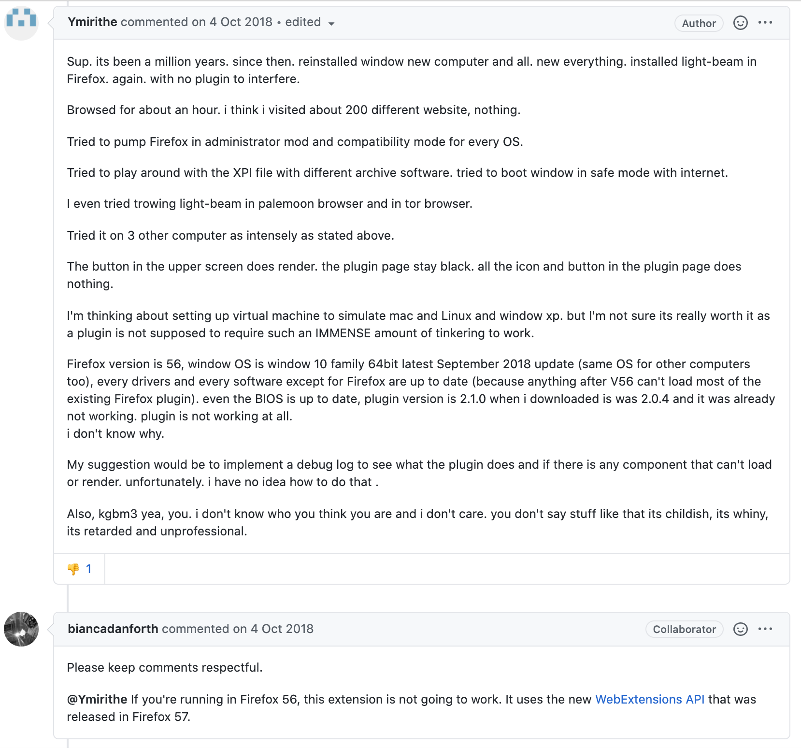

After learning `git` for the first time in 2015, I was expecting to contribute more to opensource.

But the reality turned out to be different.

---

In this post, I will talk about the expectation and reality of opensource contributions from my perspective of being both a contributor and a maintainer using 7 real-world examples.

## Time

Hoping to land my first-time contribution, I started observing 2016’s [Hacktoberbest](https://hacktoberfest.digitalocean.com/). But I was lost with the plenty of opensource projects to choose from. In 2015, I had a [first failed attempt](../ace-your-outreachy-application/#not-every-attempt-is-successful), but I was very determined in 2016. The entire October went with selecting projects until I settled down with the dev tools debugger project. It took another 3 months of observation into the project before I was confident of claiming the first issue.

### Reality #1

> Although I was comfortable after my first pull request, finding the time to work on more contributions was constantly challenging.

## Guilt

When not being able to find the time to work on opensource, there was the guilt factor for leaving a pull request open for more than 2 weeks, or claiming an issue to work on but not being able to commit to work on it.

### Reality #2

> You have to learn to say NO without feeling guilty.

## Motivation

When you have the motivation it is easy to find the time to work on something. As I recall today, it does seem funny, but I wanted to get into opensource to have more green boxes in my [Github profile](https://github.com/princiya).

Today, I am happy with my opensource contribution graph.

### Reality #3

> An all green github graph is just a myth! Whoever has one, did not escape the [burnout](https://opensource.com/article/20/3/burnout).

### Imposter Syndrome

Whenever someone leaves a comment on an issue or a pull request I have been working on, I immediately get into the 'prove-it-again' bias mode and spend more time figuring out how to explain things in the best way. The feeling of wondering if my pull request is ok or me having explained something in the pull request is ok has not faded away but improved over the years.

Once I opened an issue and it was marked as duplicate. The imposter feeling kicked in and was preventing me from further exploring issues.

As for the horrible experience considered, my first nightmare was when someone commented on an issue I tried to help with a negative comment.

> Why do you still use this ugly hack instead of just installing xxxxxxxxxx?

What was bad about this comment, you may ask. Firstly, you cannot expect everyone to be at the same level as you in the opensource world. Obviously, I didn't know why the person referred it to be a hack and using `ugly` alongside made it even worse.

### Reality #4

> I kept thinking about this person's comment for a good number of days and it made me question my [imposter](https://princiya777.wordpress.com/2017/07/16/am-i-a-fraud/) once again.

**Tip:** When you offer to give suggestions, write an explanation why you think they are relevant. From the above example, it would have been very helpful for me to know what was hacky about my solution.

## #5: Diversity

Although there is a huge [gender gap](https://princiya777.wordpress.com/2018/04/04/working-in-the-open/) in opensource, the diversity count for opensource is definitely improving! Contributing to opensource means you are working in the open, the code is out for the public. Not everyone will be comfortable with this kind of way of working.

I still remember the days how I used to fret when I was sitting next to my boss during the initial weeks of my first job as a Programmer. I used to be constantly conscious during our pair programming sessions. As with anything else, with practice and time I got through this fear and anxiety.

The opensource community needs to be more sensitive to first time contributors, especially people from under-represented groups given that the imposter syndrome is prevalent.

> Avoid nit-picking for first-time contributors.

### Reality #5

> Not everyone is a native English language speaker.

Hence you can ignore the grammatical errors while naming variables or functions. Also, avoid using abbreviations as much as possible to avoid nit-picking for first-time contributors.

### Free work

Another example I can recall of a bad experience is when I added `+1` to an already reported issue. I was a bit disappointed as to why the maintainer had downvoted my comment. I discussed this point with another maintainer, and he explained why this was not a good practice.

**Tip:** It helps a maintainer when you explain in detail. In the example above, what would have helped the maintainer was me being able to replicate the issue, write detailed steps, and help them debug the issue rather than write `+1` as a comment.

### Reality #6

> Most of the maintainers do a lot of the opensource work for free!

While we have the best intentions to contribute to opensource, we need to be mindful of everyone's time and try to do our bit to improve maintainers' life rather than just complaining. Reporting issues certainly helps maintainers to get feedback, but a lot of incomplete issues will only make their life terrible.

At work, a colleague of mine was once complaining about how an opensource project, although very good, wasn't up-to-date and was blaming the maintainers as to why they could not spend time maintaining it. I advised him to contribute to the project himself and thereby help the maintainers.

### Respect

The following incident happened to a repository I have been maintaining. There is no point venting your frustration unless you are offering to be helpful.

### Reality #7

> Every contributor and maintainer deserves respect.

Remember that most of the opensource contributions happen for free of cost. Be respectful of the contributors' and maintainers' blood, energy, and sweat.

---

**Notes**: The illustrations used in this post are from [blush.design](https://blush.design/) and the images were worked out using [vectr](https://vectr.com/).