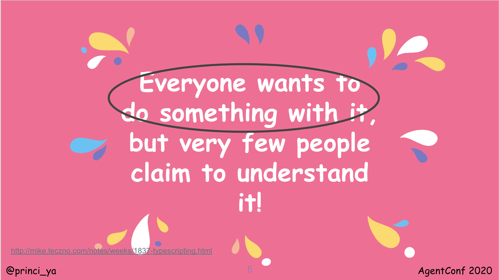
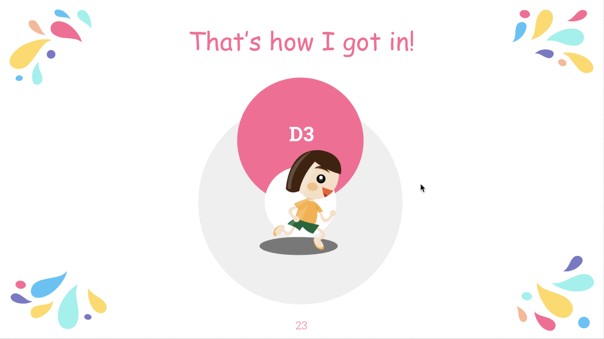

Earlier this year, I spoke at [AgentConf 2020, Dornbirn, Austria](https://agent.sh/agent-conf-2020) on `To D3 or not`.

- [Slides](https://docs.google.com/presentation/d/1GTh4q30nkt95X1ysky4LkLYk9Jg3e3si_wXMn5GkWKA/edit?usp=sharing)
- [Video](https://www.youtube.com/watch?v=n2ZArMqtIQw&list=PL02Kht_parVlg-EPMtMjwMFI2N1N7t_HH&index=5&t=0s)

## My first encounter with D3.js

I was working at a research lab [Aiaioo Labs](http://aiaioo.com/) doing work on artificial intelligence (AI), machine learning (ML) and natural language processing (NLP). One of the research projects was `Intelligent Digital Menu for Restaurants` which had a graph to show trends based on a recommendation algorithm for the digital restaurant menu. A designer colleague came up to me with a prototype and asked what did I think! It was an interactive bar and line chart.

Given my JavaScript background, and back then with a most recent experience of hacking into Yuijs (Yahoo Charts), I said I would make it work! D3 was like jQuery, but most important to me, it was JavaScript!

The year was 2012, and `Big Data` was the new hype back then. I was also volunteering for [DataKind Bangalore](https://www.datakind.org/) during the weekends. Amidst a bunch of data scientists, I was the data viz diva with my D3 skills!

## Lightbeam

In 2017, I worked on [Lightbeam](https://princiya777.wordpress.com/category/lightbeam/) with [Mozilla](https://medium.com/read-write-participate/shining-a-light-on-web-tracking-2194cdbdae5c), a browser extension which shows first and third party web trackers as you browse the internet. The visualisation grows based on your browsing history, and uses an interactive force-directed graph which uses D3's force-directed graph algorithm. The initial work was supported by [Outreachy](https://www.outreachy.org/apply/) and later funded by [PrototypeFund.de](https://prototypefund.de/en/project/lightbeam/)

